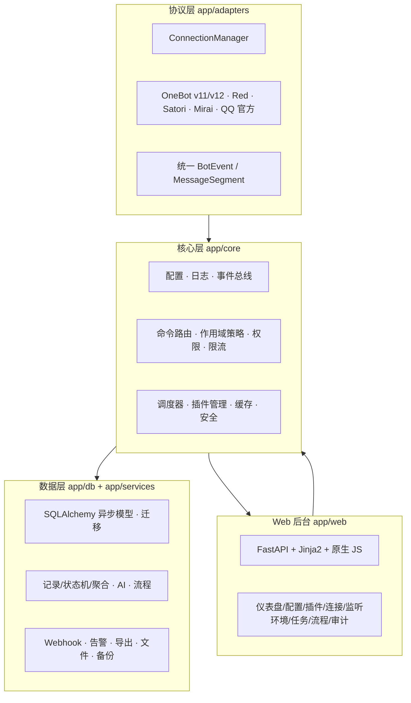
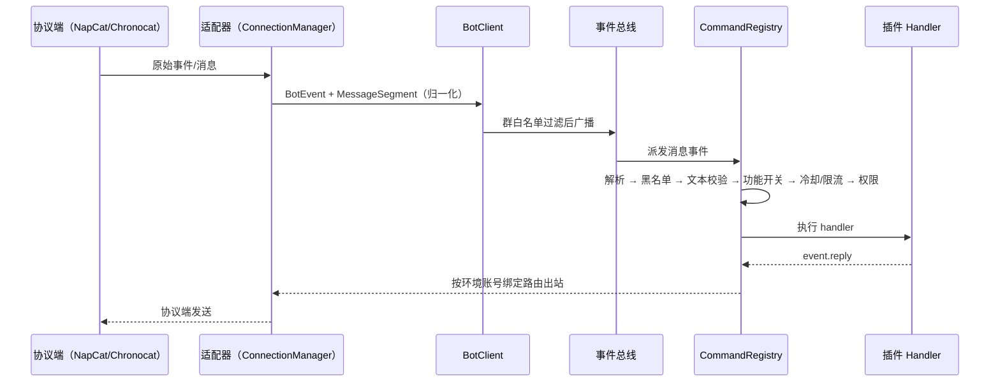

# 架构说明

OFbot 2 采用四层架构，职责清晰、可独立演进：



## 消息流



## 监听环境与作用域

每条消息都会推导出所在环境：群消息 → `group:<id>`，私聊 → `private:*`（单一私聊环境）。`ScopePolicyService` 按环境裁决：

- 功能开关优先级：`group:<id>` 覆盖 > `group:*` 覆盖 > `enable_on_default`；私聊只看 `private:*`。
- 权限：环境的 `permissions[perm]` 存在则覆盖全局权限。
- 黑名单：环境 `blocked_users` 叠加全局 `security.blocked_users`。
- 出站路由：环境 `connection` 绑定连接 ID，未绑定走第一个已连接适配器。

所有配置存于 `config.yaml` 的 `runtime.scopes`，Web / CLI 修改后即时同步内存策略。

## 插件生命周期

```text
PluginManager.discover() → 解析 plugin.json（api_version / name / dependencies）
  → 依赖拓扑排序 → load_plugin：
      执行模块 → create_plugin() → setup(ctx)
      → 按 features 自动注册命令 / 登记任务 / 包装监听器（handler 符号校验）
  → start_plugin()（异步启动）
  → unload_plugin()：停止实例、清理命令/订阅/调度任务/Web 路由引用
```

- 插件只能通过 `PluginContext` 访问框架能力，禁止直接依赖全局单例。
- 插件模型表结构不支持热更新：改 `models.py` 后需重启执行 `create_all` / 迁移。
- 插件启停为声明式优先；运行时 `ctx.commands` / `ctx.subscribe` / `ctx.scheduler` 作为动态逃生通道（不入功能矩阵）。

## 多连接与账号绑定

`transport.connections` 是连接配置的唯一来源，`ConnectionManager` 统一管理适配器生命周期（连接/重连/启停/状态），单连接故障不影响其他。每个连接有独立 `bot_id` 与事件命名空间；出站消息按监听环境绑定的连接路由，入站事件天然来自实际收到消息的连接。

## 调度与任务

- DB 定时任务（`tasks` 表）：唯一事实来源，启动时恢复 `enabled=True` 的任务。
- 插件任务（manifest `tasks`）：登记进内存 `PluginTaskRegistry`，网页只读展示 + 启停；执行前按目标环境功能开关门控。
- 后台任务：有界 `asyncio.Queue` + worker pool，导出/备份/媒体下载等重任务不阻塞消息循环。
